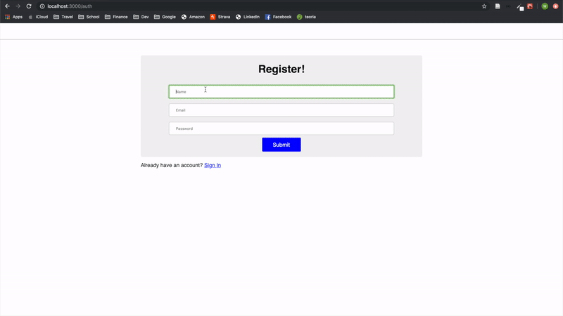
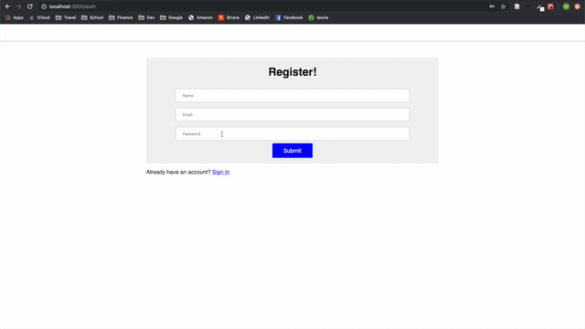
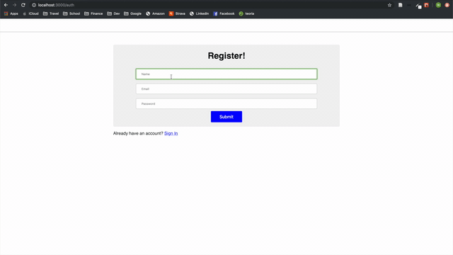
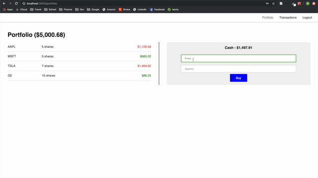

# stock-market-app

A web-based stock portfolio application for Oscar Health / TTP Stage II Code Challenge.

## Demo

## Getting Started

### Prerequisites

Clone down this repository. You will need `node` and `npm` installed globally on your machine

### Installing

Installation:

`npm install`

To Start Servers:

`npm start`

## Built With

* [React](https://reactjs.org) - The web framework used
* [npm](https://www.npmjs.com) - Dependency Management
* [Node.js](https://nodejs.org/en/) - JavaScript based Server Environment
* [Express](https://expressjs.com) - Node.js web application framework
* [GraphQL](https://graphql.org) - Query language used
* [MongoDB](https://www.mongodb.com) - Database used

### Packages

* [react-router-dom](https://www.npmjs.com/package/react-router-dom)
* [alphavantage](https://www.npmjs.com/package/alphavantage)
* [axios](https://www.npmjs.com/package/axios)
* [bcrypt](https://www.npmjs.com/package/bcrypt)
* [express](https://www.npmjs.com/package/express)
* [express-graphql](https://www.npmjs.com/package/express-graphql)
* [graphql](https://www.npmjs.com/package/graphql)
* [graphql-iso-date](https://www.npmjs.com/package/graphql-iso-date)
* [jsonwebtoken](https://www.npmjs.com/package/jsonwebtoken)
* [mongoose](https://www.npmjs.com/package/mongoose)
* [nodemon](https://www.npmjs.com/package/nodemon)

## Reflection

This was a 1 week long project built for Oscar Health / TTP Stage II Code Challenge. Project goals were to build a stock market portfolio web application that met several deliverables: 

  1. As a user, I want to create a new account with my name,email, and passwordso that I can buy and trade stocks.
  - Default the user’s cash account balance to $5000.00 USD.
  - A user can only register once with any given email.
  
  
  
  2. As a user, I want to authenticate via email and password so that I can access my account.
  
   
   
  3. As a user, I want to buy shares of stock at its current price by specifying its ticker symbol and the number of sharesso that I can invest.
  - A user can only buy whole number quantities of shares.
  - A user can only buy shares if they have enough cash in their account for a given purchase.
  - A user canonly buy shares if the ticker symbol is valid.
  
  
  
  4.As a user,I want to view a list of all transactions I’ve made to date (trades) so that I can perform an audit.
  
  5. As a user, I want to view my portfolio (a list of all the stocks I ownalong with their current values) so that I can review performance.
  - Current values should be based on the latest price and quantity owned for a given stock.
  - Each stock owned should only appear once.
  6. As a user, I’d like to see the font color of stock symbols and current prices inmy portfolio change dynamically to indicate performance.
  - Display red when the current price is less than the day’s open price.
  - Display grey when the current price is equal to the day’s open price.
  - Display green when the current price is greater than the day’s open price.
    
For the server side, I wanted to build this app in Node.js in an Express framework and use GraphQL API design architecture with a MongoDB database. I chose this stack because all of these technologies work really well together and I felt that it was perfect for the project at hand. I really enjoy working with Node.js and I like working with its event driven arghitecture. I used GraphQL so I could fetch exactly what I wanted and I like working with its schema and type system. Lastly the models were simple, so MongoDB works great as a database. For the client side, I wanted to build the app in React because of its component structure and easy setup with create-react-app.
    
My schema included User, Stock, and Transaction models where a each of a users stocks held single ticker with aggregated transaction data (total shares) for ease of use on the front end. I used bcrypt and json web tokens to hash passwords and authenticate users. I call to the Alpha Advantage API from the back end using both `axios` and the `alphavantage` packages. On the client side, I made use of `react-router-dom` for routing the applicaiton, took advantage of the component structure, and styled the project with custom CSS.

I had fun working on this project and learned a lot. It was a great opportunity.

## Acknowledgments

* Elias Zamaria and Lloyd Banks from stackoverflow for regex sample to add commas to numbers at every thousands place
